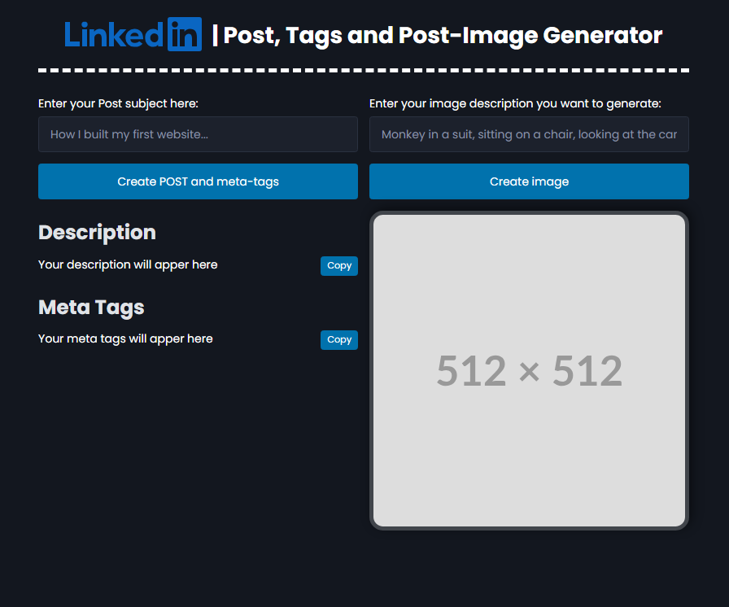

# LinkedIn Post Generator

A web application that helps LinkedIn users generate engaging posts, meta tags, and custom images using OpenAI's GPT and DALL-E APIs.



## Features

- Generate engaging LinkedIn posts based on your subject
- Create relevant meta tags for better post visibility
- Generate custom post images using DALL-E 3
- Real-time loading states and feedback
- Copy to clipboard functionality
- Responsive design for mobile and desktop

## Tech Stack

- OpenAI API (GPT-3.5 Turbo and DALL-E 3)
- PicoCSS for styling
- Vanilla JavaScript for frontend
- Vercel api handler for backend

## Setup

1. Clone the repository
2. Install dependencies:

```bash
npm install
```

3. Create a `.env` file in the root directory and add your OpenAI API key:

```
OPENAI_API_KEY=your_api_key_here
```

4. Install the latest version of Vercel CLI, run this command:

```bash
npm i -g vercel
```

5. Start the server:

```bash
vercel dev
```

6. Open `http://localhost:3000` in your browser

## Usage

### Generating Posts and Tags

1. Enter your post subject in the left form
2. Click "Create POST and meta-tags"
3. The AI will generate a compelling post and relevant tags
4. Use the copy buttons to easily copy the content

### Generating Post Images

1. Enter an image description in the right form
2. Click "Create image"
3. DALL-E will generate a custom image based on your description

## Environment Variables

- `OPENAI_API_KEY`: Your OpenAI API key (required)

## License

ISC
